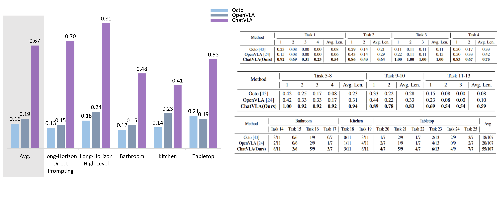
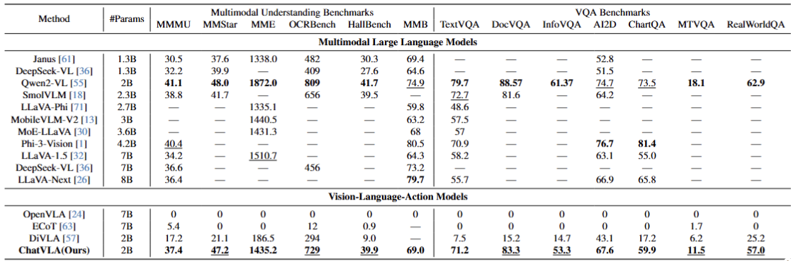

<h1 align="center">
ChatVLA: Unified Multimodal Understanding and Robot Control
with Vision-Language-Action Model
</h1>


## Contents
- [Install](#install)
- [Download Pretrained VLM](#Download-Pretrained-VLM)
- [Data Preparation](#data-preparation)
- [Training](#train)
- [Evaluation](#evaluation)
- [ChatVLA Weights](#chatvla-weights)

## Install

1. Clone this repository and navigate to ChatVLA folder
```bash
git clone <repository-url>
```

2. Install Packages
```Shell
conda create -n chatvla python=3.10 -y
conda activate chatvla
pip install --upgrade pip
pip install -r requirements.txt
cd policy_heads
pip install -e .
```
For training acceleration, please install flash_attention.
```shell
pip install flash-attn --no-build-isolation
```

3. For evaluation on multimodal understanding task, you should install other packages in the requirements file in evaluate/VLMEvalKit.

## Download Qwen2_VL Weights

We construct the VLM backbone by integrating Qwen2-VL-2B, a powerful and efficient model, into our framework. 
The Qwen2-VL 2B serves as the core of our architecture, providing robust capabilities 
for vision-language tasks. We use off-the-shelf Qwen2-VL model without any post training on VLM itself. You can download the official weights from the official repository.

**❗❗** After downloading the standard weights, you have to replace the official "config.json"
with our "doc/config.json" designed for VLA.

## Data Preparation
1. Our data format follows the standard DexVLA format, you should transfer your data into h5py format.

2. Download llava_v1_5_mix665k dataset or use your own Vision-Language Data using LLaVA-format.
```python
    [
        {
            "id": "000000033471",
            "image": "coco/train2017/000000033471.jpg",
            "conversations": [
            {
                "from": "human",
                "value": "<image>\nWhat are the colors of the bus in the image?"
            },
            {
                "from": "gpt",
                "value": "The bus in the image is white and red."
            }
            ]
        },
    ]
```

3. Add entries in aloha_scripts/constants.py to specify the path of your data as follows. 
```python
    "example_tasks_stage_1": { # for Stage 1 w/o Vision-Language Data
        'dataset_dir': [
            ROBOT_DATA_DIR + '/your_task_1',
            ROBOT_DATA_DIR + '/your_task_2',
        ],
        'episode_len': 1000,
        'camera_names': ['left', 'right', 'wrist'],
    },
    "example_tasks_stage_2": { # for Stage 2 with Vision-Language Data
        'dataset_dir': [
            ROBOT_DATA_DIR + '/your_task_1',
            ROBOT_DATA_DIR + '/your_task_2',
        ],
        'vl_file': os.path.join(VL_IMAGE_DIR, "llava_v1_5_mix665k.json"), # replace to your own VL Data if needed
        'vl_image_dir': os.path.join(VL_IMAGE_DIR, "data"),
        'episode_len': 1000,
        'camera_names': ['left', 'right', 'wrist'],
    },
```

4. Save original Qwen2_VL weights to init MoE. 

    You can refer to save_mlp_weights_for_init_moe.py

## Training
We provided training scripts for both stages in scripts/train_stage_1.sh and scripts/train_stage_2.sh.
For each script, you should change the following parameters:
1. **OUTPUT**: the save directory for training. 

    **❗** the keyword "qwen2" must be included in OUTPUT.

2. **TASK**: the tasks used for training. This should be corresponded to your own task name in aloha_scripts/constants.py.

    **❗** Stage 2 should use a different task name compared with Stage 1 as it utilize vision-language data in training.

3. **MNOP**: model name or path. You should change to path to the pretrained VLM weights.

Other hyperparameters like "batch_size", "save_steps" could be customized according to your computation resources.

Start training by following commands:

### Stage 1: Training with Robot Data only
Key arguments:
```shell
--using_moe True \
--init_moe True \
--freeze_vl_expert True \
```
### Stage 2: Co-training with VL Data
Key arguments:
```shell
--using_moe True \
--init_moe False \
--vl_ratio 0.33 \
```
vl_ratio controls the ratio of VL Data and Robot Data, you can change it as you like.

## Evaluation
**❗❗** Make sure your trained checkpoint dir has two files: "preprocessor_config.json" and "chat_template.json".
If not, please copy them from downloaded Qwen2_VL weights.

### Evaluation on Real Robot

You can refer to our evaluation script evaluate/evaluate_robot.py to evaluate your ChatVLA.




### Evaluation on Multi-modal Understanding Tasks
We leverage the excellent VLMEvalKit for evaluating ChatVLA. The toolkit has been integrated into our project with minor modifications to support ChatVLA's evaluation framework.

To evaluate on multi-modal understanding tasks, you should:
1. Set a path "LMUData" to download datasets (default path is '~'). Your LMUData folder should looks like:
```shell
LMUData
├── images/
│   ├── MMMU/
│   └── MMStar/
├── MMStar.tsv
└── MMMU_DEV_VAL.tsv
``` 
2. Modify the config evaluate/VLMEvalKit/config_vla.json to decide the model path and the benchmarks you want to evaluate on. 
3. Run the evaluation script evaluate/evaluate_vqa.sh to evaluate ChatVLA on multi-modal understanding tasks.

Note: To evaluate our ChatVLA on more benchmarks, you should modify the config following the original VLMEvalKit setting.



## Acknowledgement
We build our project based on several open-source projects including LLaVA, act-plus-plus, Miphi, DexVLA, and VLMEvalKit.